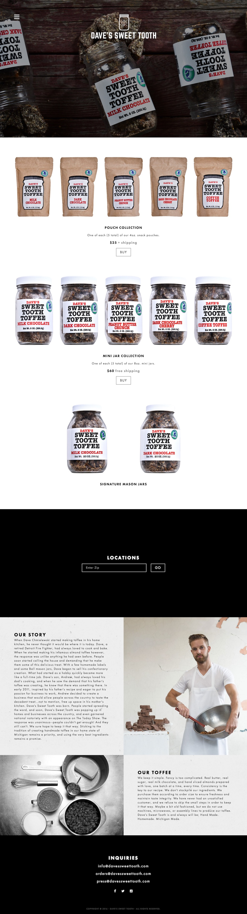

# davessweettooth

## Products
Pouches, mini jars, and jars are configured using the products.json file. It also contains some basic configurations for the collection items.

## Locations
Locations are managed using the manage-locations.php page. This page generates the locations.json file used for the google map. The page is protected using a very basic secret technique. The secret is stored in a file named _locations-secret_. To access manage-locations.php, secret must be passed as a query parameter - http://localhost/manage-locations.php?secret=secret. The _locations.json_ and _locations-secret_ files should __NEVER__ committed to the repository.

## Preview

## Locations Functionality

